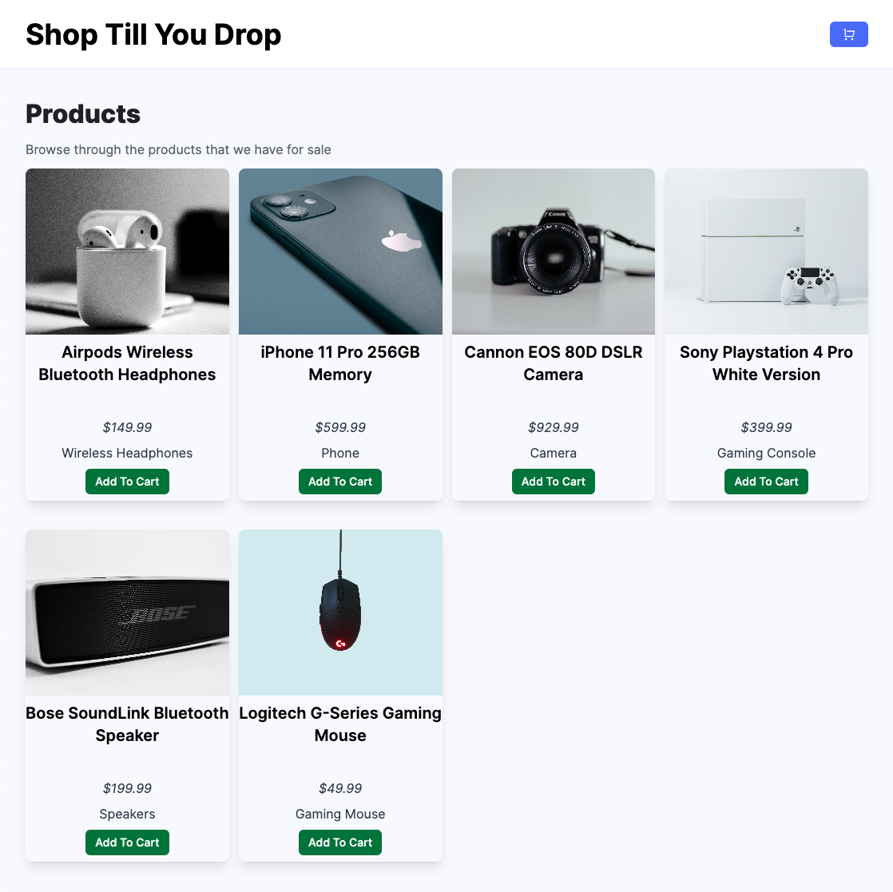
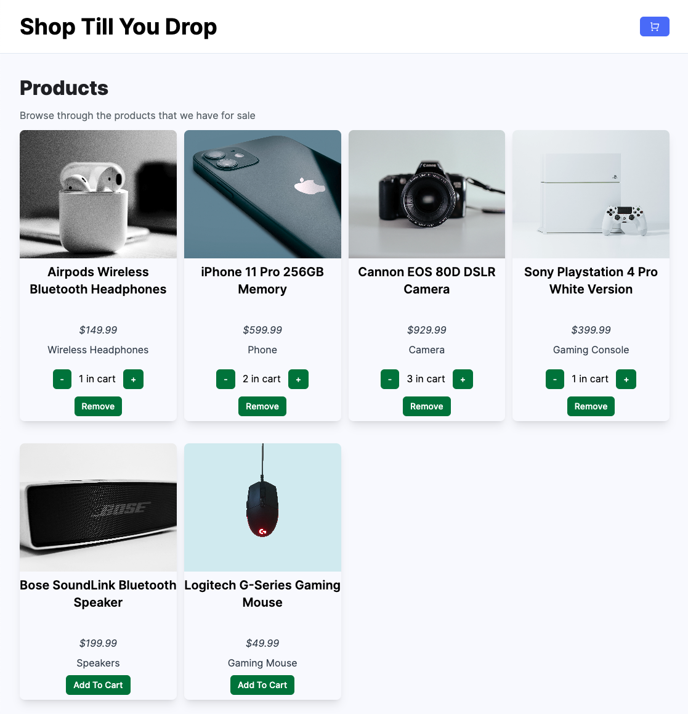
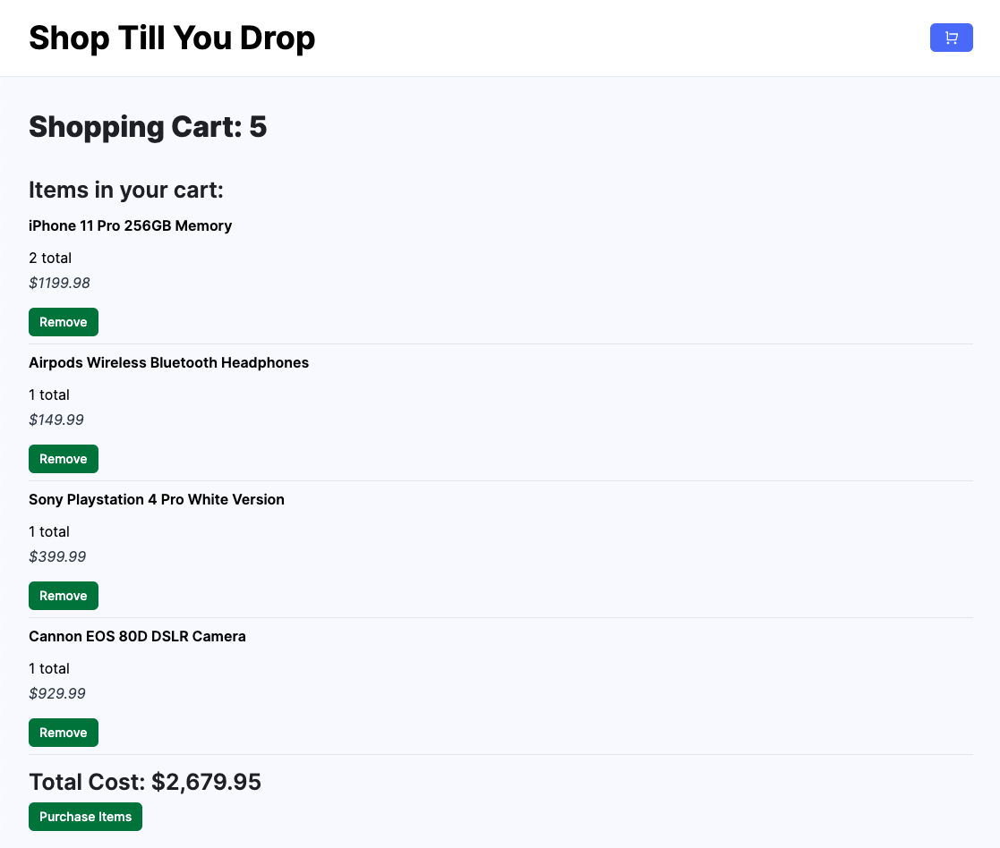

# shop-till-you-drop
A full stack application that allows a user to browse electronics products and add/remove them from a shopping cart. Built using the MERN stack.

## Description
Shop Till You Drop was developed as a portfolio project that showcases my skills and knowledge with the development of a full stack application using the MERN stack. I built this app from the ground up and really enjoyed seeing it all come together. I learned a lot more about passing props, using context within React, as well as styling with Tailwind CSS. The overall process of putting an app together from start to finish is something that I really enjoy and it brings great satisfaction when you get to see the finished product.

## Installation

The steps to install my project are as follows:

- Clone or fork my code from GitHub
- Install the required dependencies
- Run "npm run seed" to insert the dummy data into MongoDB
- Run "npm run dev" to run the live preview of the app
- Run the server from the command line using "npm run start"

## Usage

Here is the deployed app:
[Shop Till You Drop](https://ezshoptillyoudrop.website/)

The homepage:

Adding products to your cart:

The shopping cart:

## License

MIT License

Copyright (c) 2023 Erich Z.

Permission is hereby granted, free of charge, to any person obtaining a copy of this software and associated documentation files (the "Software"), to deal in the Software without restriction, including without limitation the rights to use, copy, modify, merge, publish, distribute, sublicense, and/or sell copies of the Software, and to permit persons to whom the Software is furnished to do so, subject to the following conditions:

The above copyright notice and this permission notice shall be included in all copies or substantial portions of the Software.

THE SOFTWARE IS PROVIDED "AS IS", WITHOUT WARRANTY OF ANY KIND, EXPRESS OR IMPLIED, INCLUDING BUT NOT LIMITED TO THE WARRANTIES OF MERCHANTABILITY, FITNESS FOR A PARTICULAR PURPOSE AND NONINFRINGEMENT. IN NO EVENT SHALL THE AUTHORS OR COPYRIGHT HOLDERS BE LIABLE FOR ANY CLAIM, DAMAGES OR OTHER LIABILITY, WHETHER IN AN ACTION OF CONTRACT, TORT OR OTHERWISE, ARISING FROM, OUT OF OR IN CONNECTION WITH THE SOFTWARE OR THE USE OR OTHER DEALINGS IN THE SOFTWARE.
